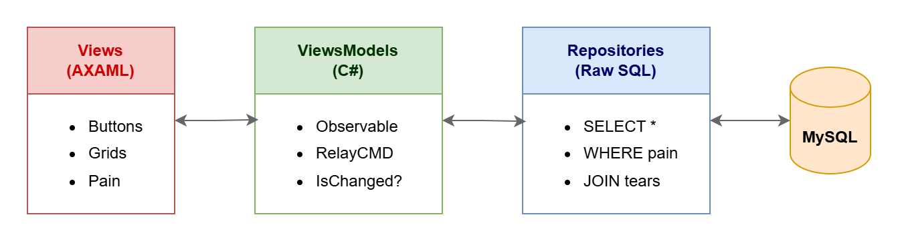
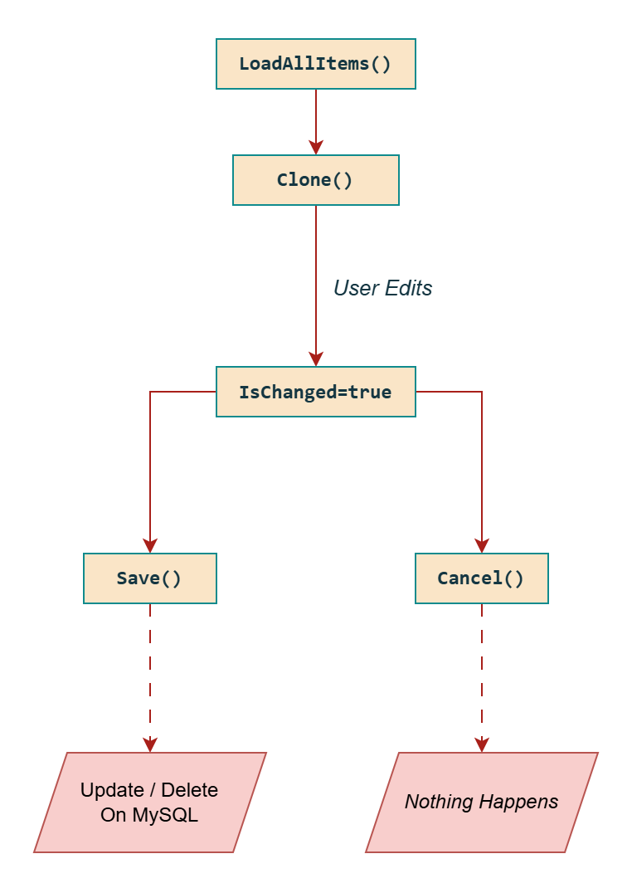
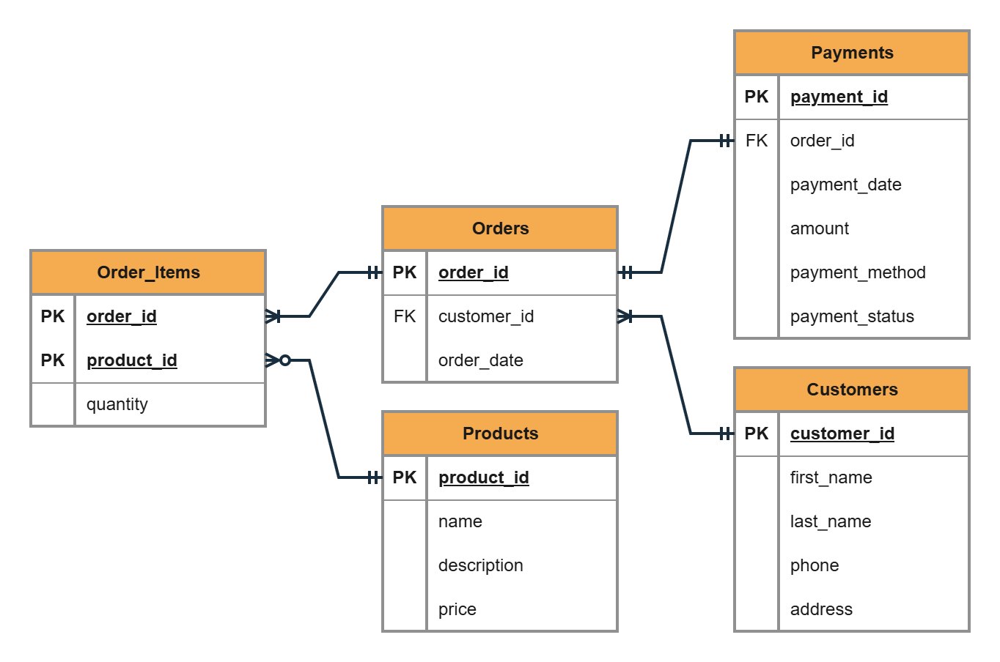

<div style="text-align: center;">
    <h1>🛒 Mini E-Commerce EDP 🚀</h1>
</div>


<div style="text-align: center;">
    <p style="font-style: italic;">"Spreaaadhseet sucks"💅<p>
</div>

A **lightweight Windows desktop e-commerce management dashboard** built with **Avalonia UI** (.NET 8) and **MySQL**. Manage products, customers, orders, payments, and generate Excel reports — all without opening a single browser tab. 🖥️✨

---

## 🍕 Why This Exists

> **Na-activity sa edp** 😭😭😭

---

## ⚡ Tech Stack (The Good Stuff)

| 🧩 Layer | 🔧 Technology | 📝 Why It's Here |
|---|---|---|
| 🖼️ **UI** | Avalonia UI 12 | Cross-platform XAML — runs everywhere, hates nobody |
| 💬 **Language** | C# 12 (.NET 8) | Because Java called and I didn't pick up |
| 🧠 **MVVM** | CommunityToolkit.Mvvm 8.4 | ObservableObject go brrrrr |
| 🗄️ **Database** | MySQL via MySqlConnector 2.5 | Raw SQL, no ORM, (NOT !!!!) all vibes |
| 📊 **Excel** | EPPlus 7 | Makes spreadsheets that would make your accountant cry 😭 |
| 📋 **Grid** | Avalonia.Controls.DataGrid | Tables on tables on tables (Primary)|

---

## 🏗️ Architecture (How This Beautiful Mess Works)
<div style="text-align: center;">
    
</div>

### 🔑 Key Design "Decisions"

- **❌ No DI container** — we instantiate repos manually like cavemen 🔨
- **❌ No ORM** — SQL is crafted by hand, like a fine artisanal sandwich 🥪
- **❌ No backend** — the desktop app raw-dogs MySQL directly 😤
- **✅ Static connection string** — set once after login, global for all to see

---

## 🚀 How It Works (The Lifecycle)

### 🔐 Startup Flow
1. `Program.cs` bootstraps Avalonia (the app awakens 🌄)
2. A **Login Dialog** asks for your MySQL creds (be nice, it's sensitive)
3. On success → `DatabaseConnection.ConnectionString` goes global 🌍
4. The **MainWindow** appears with a tab control full of data goodness

### 🗂️ Main Dashboard Tabs

| 📑 Tab | 🧠 ViewModel | 📋 What It Does |
|---|---|---|
| 🏷️ Products | `ProductTabViewModel` | CRUD your inventory like a boss |
| 👥 Customers | `CustomerTabViewModel` | Know thy customer (by name, at least) |
| 📦 Orders | `OrderTabViewModel` | View/edit orders with customer & payment deets |
| 🧾 Ordered Items | `OrderItemTabViewModel` | Read-only join view — stare but don't touch 👀 |
| 💳 Payments | `PaymentTabViewModel` | Follow the money trail 💰 |

**CRUD Flow per tab:** (Ctrl+C, Ctrl+V is the best design pattern)

<div style="text-align: center;">
    
</div>


### 🧙 The 3-Step New Order Wizard

Opened from the Orders tab — because who doesn't love wizards? 🧙‍♂️

> **Step 1:** Choose a customer (or create one — we don't judge)
> **Step 2:** Pick products, mash that **Add** button, spin quantities like a DJ 🎧
> **Step 3:** Payment method → Payment status → **SAVE** → *chef's kiss* 👨‍🍳💋

All inserted atomically: order → order_items → payment. ACID, baby! 🧪

### 📈 Reports (Fancy Excel Stuff)

Pick your poison from the ComboBox:

| 📊 Report | 📝 What You Get |
|---|---|
| **Sales Report** | All orders + line items + grand total + **chart of orders/day** 📈 |
| **Inventory Report** | Products + stock + **top-10 bar chart** 📊 |
| **Customer Report** | Customers + **pie chart by last-name initial** 🥧 |

Hit **Export to Excel** and EPPlus™️ generates a `.xlsx` so beautiful it belongs in a museum 🖼️
*(Logo included. Colored rows included. Charts included. Your boss impressed? Priceless.)*

---

## 🗄️ Database Schema (The 5 Sacred Tables)

<div style="text-align: center;">
    
</div>

Composite models like `OrderCustomerPayment` do the heavy lifting so you don't have to JOIN in your head 🧠💪

---

## 🛠️ Getting Started (The Bare Minimum)

```powershell
# 1. Install .NET 8 SDK (you probably already have it, nerd)
winget install Microsoft.DotNet.SDK.8

# 2. Create the database
mysql -u root -p -e "CREATE DATABASE mini_ecom;"
# then run the CREATE TABLEs (you're on your own, good luck 🫡)

# 3. Build and run
dotnet run --project mvvm_edp.csproj
```

Then gaze into the login dialog and whisper your MySQL password like a sacred mantra 🙏

---

## 📁 Project Structure (Where Stuff Lives)

```
📂 mini-ecom-edp/
├── 📁 Models/              # Domain entities & display models (the blueprint 🧬)
├── 📁 Repositories/        # SQL data access layer (the elbow grease 💪)
├── 📁 ViewModels/          # MVVM logic & state (the brain 🧠)
├── 📁 Views/               # XAML user controls (the pretty face 😍)
├── 📄 App.axaml            # Application styles & data templates (the wardrobe 👗)
├── 📄 ViewLocator.cs       # Convention-based View→ViewModel resolver (the matchmaker 💘)
└── 📄 mvvm_edp.sln         # Solution file (Open this → profit 📈)
```
## As Always...
---


```
It's not a bug...
        ...it's an "unexpected feature"™️
```

---

## 🤝 Contributing

1. Fork it 🍴
2. Create a branch: `git checkout -b feature/pizza-button` 🍕
3. Commit: `git commit -m "added pizza button because why not"` ✅
4. Push: `git push origin feature/pizza-button` 📤
5. Open a PR and pray 🙏

---

## 📜 License

Do whatever you want. Seriously. Just don't blame me when production goes down. 🫠

---

> **Made with 💖, ☕, 😤, and a concerning amount of MySQL queries.**
> 
> *"It's not much, but it's honest work."* — Every dev ever
